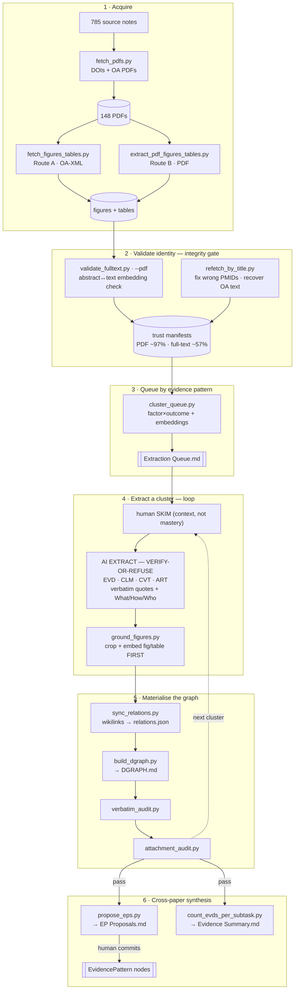

# Progress — LEP / language-concordance synthesis pipeline

A reproducible pipeline that turns the LEP corpus (785 source notes) into a **grounded discourse
graph** (Questions → Claims → Evidence → Caveats, plus cross-paper EvidencePatterns and Artifacts),
with data-integrity checks at every step. Methodology adapted from `living-synthesis-remix`; see
`plans/extracting-discourse-nodes.md` for the design and `CLAUDE.md` + `Skill*.md` for the operating
rules.

## The process so far

**The load-bearing rule:** *ground only in validated sources, and the extractor must verify a paper's
identity and refuse rather than fabricate.* This was learned the hard way — see "Integrity" below.

## Scripts (`utils/`)

| Script | Role |
|---|---|
| `fetch_pdfs.py` | Resolve DOIs (NCBI ID Converter → OpenAlex) + download OA PDFs (Europe PMC → Unpaywall → S2 → OpenAlex); write DOIs to notes |
| `fetch_figures_tables.py` | Route A — figures/tables for OA papers via Europe PMC JATS XML + supplementary ZIP |
| `extract_pdf_figures_tables.py` | Route B — figures/tables from PDFs via PyMuPDF |
| `validate_fulltext.py` | Flag wrong-paper text/PDFs by embedding the abstract vs the body (`--pdf` for PDFs) |
| `refetch_by_title.py` | Re-resolve correct DOI/PMID/PMCID by title; flag wrong PMIDs; recover OA full text |
| `cluster_queue.py` | Seed the extraction queue: factor×outcome matrix + embeddings → provisional buckets |
| `ground_figures.py` | Locate a referenced `(Fig N)`/`(Table N)` in the PDF and embed it first in the EVD |
| `sync_relations.py` | Materialise body wikilinks into plugin `relations.json` edges (correct schema direction) |
| `build_dgraph.py` | Generate the nested QUE→CLM→EVD→⚠️CVT index (`DGRAPH.md`) from `relations.json` |
| `verbatim_audit.py` | Check every `> "…"` quote against the source PDF/full text (NFKD+alnum) |
| `attachment_audit.py` | Enforce graph invariants (CVT qualifies EVD only; every EVD→CLM/EP; every CLM→QUE; EP ≥2 papers) |
| `propose_eps.py` | Propose candidate EvidencePatterns as a human accept/reject checklist (never auto-commits) |
| `count_evds_per_subtask.py` | Refresh the per-question evidence-summary index + EP strength tags |

Generated artifacts (gitignored ones under `data/`): `DGRAPH.md`, `Extraction Queue.md`,
`EP Proposals.md`, `Evidence Summary.md`, `relations.json`, plus trust manifests and reports in `data/`.

## Current graph state

- **43 EVD · 29 CLM · 13 CVT · 2 ART · 1 EP · 6 QUE · 140 edges**, over **785 sources**.
- **~12 papers extracted end-to-end** (verify-first, verbatim-audited): an adherence cluster
  (Kahler, Moreno, Ratanawongsa, Zhang, Padilla, Stoneking, Ho, Kristen) and a length-of-stay /
  interpretation cluster (Lindholm, Lauren, L 2023, Aksharananda).
- **1 committed EvidencePattern** — *"Language accessibility/concordance, not LEP status itself, is the
  operative lever for treatment-adherence disparities"* (5 independent papers, Moderate strength).
- **156 verbatim quotes audited OK**; **13 EVDs grounded with figure/table crops** (every PDF-backed
  paper). Attachment invariants: only legacy informal-assertion claims remain unwired (see below).

## Integrity (the hard-won lessons)

- The earlier `data/fulltext/` corpus is **~43% wrong-paper / review substitutions**; PDFs are ~97%
  clean. A first parallel extraction batch trusted the corpus blindly and produced 4/4 bad papers —
  all rolled back. (See memory `fulltext-corpus-unreliable`.)
- Fixes now standing: `validate_fulltext.py` triages sources; `refetch_by_title.py` corrects wrong
  identifiers (e.g. `Maria_2023` PMID 26030609→36030609); and every extracting agent runs an
  **identity gate** — confirm the source is the right paper or refuse. This caught later false
  positives (Wallbrecht's "validated" text was a later paper citing it).

## Remaining work / debt

- **7 legacy claims have no evidence** — informal/non-empirical assertions (55% of malpractice,
  doctor time, "40% trust/adherence", etc.); each needs a real source or retirement.
- **Full-text-only papers can't be figure-grounded** (no PDF to crop); ~13 such EVDs reference a
  fig/table but have no source image.
- Optional: `quote_pipeline.py` (verbatim quote-region screenshots) and `readability_pass.py`.
- Source acquisition for non-OA papers behind orphan findings (Karliner, Adams, Abedini, Allan).
