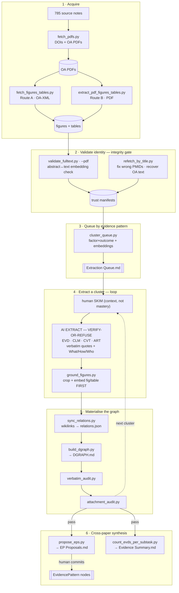

# Pipeline overview — LEP / language-concordance synthesis

The reproducible process that turns the LEP corpus (785 source notes) into a **grounded discourse
graph** (Questions → Claims → Evidence → Caveats, plus cross-paper EvidencePatterns and Artifacts),
with data-integrity checks at every step. This file is the **atemporal reference**; for what was done
when, see [[Progress Log]]. Design rationale: `plans/extracting-discourse-nodes.md` and
`plans/getting-papers.md`. Operating rules: `CLAUDE.md` + `Skill*.md`.

## The process

**The load-bearing rule:** *ground only in validated sources, and the extractor must verify a paper's
identity and refuse rather than fabricate.*

## Scripts (`utils/`)

| Script | Role |
|---|---|
| `fetch_pdfs.py` | Resolve DOIs (NCBI ID Converter → OpenAlex) + download OA PDFs (Europe PMC → Unpaywall → S2 → OpenAlex); write DOIs to notes |
| `fetch_figures_tables.py` | Route A — figures/tables for OA papers via Europe PMC JATS XML + supplementary ZIP |
| `extract_pdf_figures_tables.py` | Route B — figures/tables from PDFs via PyMuPDF |
| `validate_fulltext.py` | Flag wrong-paper text/PDFs by embedding the abstract vs the body (`--pdf` for PDFs) |
| `refetch_by_title.py` | Re-resolve correct DOI/PMID/PMCID by title; flag wrong PMIDs; recover OA full text |
| `cluster_queue.py` | Seed the extraction queue: factor×outcome matrix + embeddings → provisional buckets |
| `ground_figures.py` | Locate a referenced `(Fig N)`/`(Table N)` in the PDF and embed it first in the EVD |
| `sync_relations.py` | Materialise body wikilinks into plugin `relations.json` edges (correct schema direction) |
| `build_dgraph.py` | Generate the nested QUE→CLM→EVD→⚠️CVT index (`DGRAPH.md`) from `relations.json` |
| `verbatim_audit.py` | Check every `> "…"` quote against the source PDF/full text (NFKD+alnum) |
| `attachment_audit.py` | Enforce graph invariants (CVT qualifies EVD only; every EVD→CLM/EP; every CLM→QUE; EP ≥2 papers) |
| `propose_eps.py` | Propose candidate EvidencePatterns as a human accept/reject checklist (never auto-commits) |
| `count_evds_per_subtask.py` | Refresh the per-question evidence-summary index + EP strength tags |

Generated artifacts: `DGRAPH.md`, `Extraction Queue.md`, `EP Proposals.md`, `Evidence Summary.md`,
`relations.json`; trust manifests + reports under `data/` (gitignored).

## Integrity rules

- Ground only in **validated** sources; the extractor runs an **identity gate** (confirm the paper or
  refuse). The earlier `data/fulltext/` corpus is ~43% wrong-paper; PDFs ~97% clean.
- **Propose, don't commit** for synthesis — EvidencePatterns, merges, and summary cells are AI
  proposals; the human commits.
- Edges live in the plugin's `relations.json`; node bodies author them as wikilinks and
  `sync_relations.py` materialises them. Promotion is gated by the verbatim + attachment audits.
