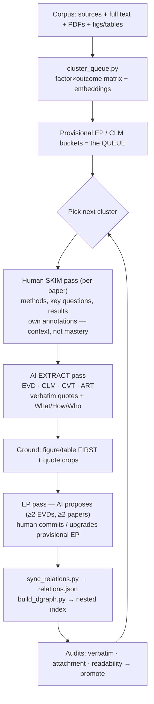

# Skill — Discourse-node extraction (orchestrator)

The workflow turns the LEP corpus into a grounded discourse graph, **queued by evidence pattern /
topic** so effort is focused. See `CLAUDE.md` for node ids, edge schema, tags, and governance.

> Load on demand:
> - `Skill-references.md` — naming, key principles, tag facets, edge-authoring, pitfalls.
> - `Skill-templates.md` — node-file templates + grounding/audit detail.
> - `Skill-synthesis.md` — EvidencePatterns, evidence-summary index, Bases (cross-paper layer).

## Review flow

## Steps

1. **Seed the queue** — `cluster_queue.py` groups papers into provisional EP/CLM buckets from the
   `Variables.md` factor×outcome matrix refined with embeddings. Pick the top cluster.
2. **Skim (human)** — per paper, get overall context: key questions, design, sample, headline results.
   Goal is orientation, not mastery. Capture own annotations.
3. **Inventory nodes** — list QUE / EVD / CLM / CVT / ART to create *before* writing files (atomicity:
   one finding per EVD, one generalization per CLM, one limitation per CVT).
4. **Write node files** — from `Skill-templates.md`. EVD carries the inverted What/How/Who Methods
   Context; embed the **grounding figure/table first** (it becomes the keyImage), then verbatim quotes.
   Set `nodeTypeId` + `nodeInstanceId`, domain facets + one `epistemic/*` tag.
5. **Author edges as wikilinks** — CLM/EP list their Supporting/Contradicting EVDs; CVT lists what it
   Qualifies; QUE nests its CLMs. (See Skill-references "Edge authoring".)
6. **Ground** — `quote_pipeline.py` (quote crops) + `ground_figures.py` (figure/table embeds from
   `data/figures[_pdf]/`).
7. **EP pass (propose, don't commit)** — `propose_eps.py` emits a checklist of candidate EPs (≥2 EVDs
   from ≥2 papers) + provisional→real upgrades + merge maps. Human accepts/rejects; commit accepted EPs.
8. **Sync + index** — `sync_relations.py` → `relations.json`; `build_dgraph.py` → nested index;
   `count_evds_per_subtask.py` refreshes EP strength + summary captions.
9. **Audit + promote** — `verbatim_audit.py`, `attachment_audit.py`, `readability_pass.py`; promote
   NodeFormality `draft → ReadyForInternal` when they pass.
10. **Log provenance** — save the originating prompt and a History entry (files touched, counts, scripts).

Then loop to the next cluster.
