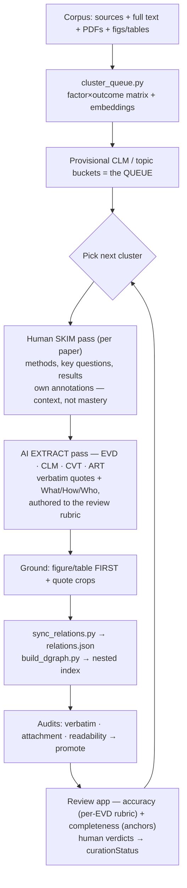

# Skill — Discourse-node extraction (orchestrator)

The workflow turns the LEP corpus into a grounded discourse graph, **queued by topic / cluster**
so effort is focused, and **authored to the review rubric** so each node would pass verification.
See `CLAUDE.md` for node ids, edge schema, tags, and governance.

> **EP retired (2026-06).** No EvidencePattern nodes. Cross-paper convergence lives on the **CLM**
> (a claim aggregates EVDs from ≥2 papers); the body-of-evidence/certainty judgment is an
> **expert task on the CLM** (`certainty` + `## Evidence appraisal`) — AI does not draft it. Canonical
> record: `plans/methodology-decisions.md`.

> Load on demand:
> - `Skill-references.md` — naming, key principles, tag facets, edge-authoring, pitfalls.
> - `Skill-templates.md` — node-file templates + grounding/audit detail.
> - `Skill-synthesis.md` — cross-paper synthesis layer (over CLMs), evidence-summary index, Bases.
> - `discourse-extraction/node-spec.md` — the per-node **quality & completeness rubric** (the bar
>   each node is authored to and reviewed against); portable, source-agnostic.

## Review flow

## Steps

1. **Seed the queue** — `cluster_queue.py` groups papers into provisional CLM/topic buckets from the
   `Variables.md` factor×outcome matrix refined with embeddings. Pick the top cluster.
2. **Skim (human)** — per paper, get overall context: key questions, design, sample, headline results.
   Goal is orientation, not mastery. Capture own annotations.
3. **Inventory nodes** — list QUE / EVD / CLM / CVT / ART to create *before* writing files (atomicity:
   one finding per EVD, one generalization per CLM, one limitation per CVT).
4. **Write node files — to the rubric.** From `Skill-templates.md`; author each EVD so it would pass
   the review rubric (`discourse-extraction/node-spec.md`): verbatim-grounded, **What/How/Who each
   grounded in its own quote**, substantively faithful, grounding figure/table embedded first (the
   keyImage) or correctly none, linked to ≥1 CLM with correct polarity, **EVD past tense / CLM present
   tense**. Set `nodeTypeId` + `nodeInstanceId`, domain facets + one `epistemic/*` tag.
5. **Author edges as wikilinks** — CLM lists its Supporting/Contradicting EVDs; CVT lists what it
   Qualifies; QUE nests its CLMs. (See Skill-references "Edge authoring".)
6. **Ground** — `quote_pipeline.py` (quote crops) + `ground_figures.py` (figure/table embeds from
   `data/figures[_pdf]/`).
7. **Sync + index** — `sync_relations.py` → `relations.json`; `build_dgraph.py` → nested index.
8. **Audit + promote** — `verbatim_audit.py`, `attachment_audit.py`, `readability_pass.py`; promote
   NodeFormality `draft → ReadyForInternal` when they pass.
9. **Review (accuracy + completeness)** — precompute the review data, then verify in the review app
   (see "Review-app integration" below). Reviewer verdicts advance `curationStatus`; AI never advances
   it, and never drafts a CLM's `certainty`/`## Evidence appraisal`.
10. **Log provenance** — save the originating prompt and a History entry (files touched, counts, scripts).

Then loop to the next cluster.

## Review-app integration

The review app (`site/`, routes under `/review`) is where humans verify what the AI extracted. The
extraction step and the review step share **one rubric** — `discourse-extraction/node-spec.md` — so
"author to the rubric" (step 4) and "review against the rubric" are the same checklist from both ends.

- **Two passes.** *Accuracy* (`/review/accuracy`) walks each EVD against the per-node rubric —
  verbatim · grounding · claim-link/polarity · **substantive** fidelity · methods (What/How/Who, each
  graded). *Completeness* (`/review`) checks the lists a source enumerates (abstract results,
  tables/figures) are covered. Verdicts: `✓ correct · ✎ edit · ✗ wrong · ⟳ missing · — n/a`.
- **Precompute the review data** (gitignored → `site/review-data/`, served at build + runtime):
  `build_review_anchors.py --cluster` (completeness anchors), `build_accuracy_pages.py <citekeys>`
  (journal→physical page map), `build_quote_regions.py <citekeys>` (exact quote/figure rects for the
  pdf.js overlay). Match the citekeys to `ACCURACY_BATCH` in `site/lib/review-accuracy.ts`
  (+ `CURATED_EVD_TITLES` to show a curated subset). PDFs stream from a private Supabase bucket
  (`scripts/upload-review-pdfs.mjs`).
- **`curationStatus` is the spine.** AI authors every node at `Initial AI draft`; reviewer judgments
  (collected centrally in Supabase, surfaced in the maintainer queue `/review/queue` with disagreement
  + CSV/JSON export) drive the advance to expert-verified. The renderer's status badge reflects it.
- **Governance unchanged** — propose, don't commit. The agent extracts + proposes; the human accepts/
  edits and owns certainty.
