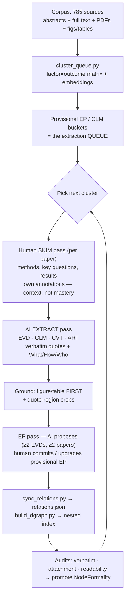

# Extracting discourse nodes — porting the living-synthesis skill system

## Context

We want to extract a grounded **discourse graph** (Questions → Claims → Evidence, plus
cross-paper patterns) from the LEP / language-concordance corpus (785 sources in
`Discourse Graph/Sources/`, now with DOIs, ~148 OA PDFs, 706 full-text extracts, and
extracted figures/tables under `data/figures/` + `data/figures_pdf/`).

The extraction methodology is ported from `/Users/joelchan/Projects/living-synthesis-remix`
— a mature per-paper skill (CLAUDE.md + `Skill.md`/`Skill-references.md`/`Skill-templates.md`
+ a script pipeline) — **adapted** to this domain and to this vault's architecture.

**Key architectural difference from the source vault:** this vault uses the **Discourse Graphs
Obsidian plugin** with *first-class edges* (`relations.json`, `nodeInstanceId`,
supports/opposes/informs) rather than the remix's markdown-section reverse-links. The port
respects that (see "Graph edges" below).

## Decisions (confirmed)

| Decision | Choice |
|---|---|
| Scope | **Full port** incl. all scripts, adapted, + an end-to-end pilot |
| Graph edges | **Hybrid** — plugin `relations.json` is the source of truth for edges; a generated DGRAPH-style nested index (read from `relations.json`) for review/navigation |
| Third tag/field facet | **Care/delivery setting** (`deliveryContext`) alongside `factor` + `healthOutcome` |
| Methods-Context schema | **Inverted What/How/Who** (What = observable; How = design + ART link; Who = equivalence class) |
| Node types in scope | EVD, CLM, QUE (core) + **EP, ART, CVT, PTN** |
| Queue seeding | **Hybrid** — start from `Variables.md` factor×outcome matrix, refine/expand with embeddings |
| EVD grounding | Extracted figures/tables (figure/table **first**) **+** ported quote-region crops |
| Pilot corpus | **Top cluster** from the queue-seeding pass |

---

## 1. Node type system

Reuse the plugin's existing node-type IDs (`.obsidian/plugins/discourse-graphs/data.json`);
**add a Caveat type** (the plugin has no CVT yet). Filename conventions match the remix.

| Type | ID (existing unless noted) | Filename | Citekey in name? |
|---|---|---|---|
| Question (QUE) | `node_LsIeSJxI7M9DoE3ISFEmw` | `QUE - <text>.md` | no |
| Claim (CLM) | `node_nMxzA_OByPwgPcmb6AN82` | `CLM - <text>.md` | no |
| Evidence (EVD) | `node_huDx8FGfNSGQyongW5rk-` | `EVD - <finding> - @<citekey>.md` | yes |
| Source (SRC) | `node_Ne237S0BfRPDaeqB_gbuT` | `@<citekey>.md` | yes |
| EvidencePattern (EP) | `node_r2JRW9jgphgmMpz5mN7eG` | `EP - <pattern>.md` | no |
| Artifact (ART) | `node_OULGh2SuqxP1oES9p2k_9` | `ART - <system>.md` | no |
| Pattern (PTN) | `node_vUzzS2ZuolcZzErZfyC72` | `PTN - <concept>.md` | no |
| Caveat (CVT) | `node_Q4sxSAHaUscV3smL5OBnB` (added) | `CVT - <limitation>.md` | usually no |

**Edge schema (from `data.json`, ground truth for `sync_relations.py` / audits):**
- `EVD —supports/opposes→ CLM` (`relation_BO5Bt…` / `relation_Qtuz…`)
- `EVD —supports/opposes→ EP` (same relation ids) — **this is how EPs bundle evidence** (first-class
  `EVD→EP` edges, not just a wikilink list)
- `CVT —qualifies→ EVD` (`rel_o0a9NeAmWnhFBaVLNiJ1g`, "is qualified by") — replaces the remix's
  `appliesTo`
- `{SRC, CLM, EVD, QUE} —informs→ QUE`; `CLM —supports/opposes/informs→ CLM`

**keyImage:** EVD and ART have `keyImage: true` — the plugin surfaces the first embedded image as the
node's key image, so the "grounding figure/table first" rule (§5) doubles as the key image.

**Node identity for AI-authored nodes:** generate `nodeInstanceId` (UUIDv7) + set the right
`nodeTypeId` in frontmatter at creation (`showIdsInFrontmatter: false` only hides them in the UI;
they must still exist for `relations.json` edges to resolve).

Folder layout (extend current `Discourse Graph/` tree):
```
Discourse Graph/
├── Sources/        @<citekey>.md            (785, existing)
├── Questions/      QUE - ...                 (existing)
├── Claims/         CLM - ...                 (existing)
├── Evidence/       EVD - ...                 (existing)
├── Caveats/          CVT - ...               (NEW — set folderPath on Caveat in data.json)
├── EvidencePatterns/ EP - ...                (plugin folderPath already set)
├── Patterns/         PTN - ...               (plugin folderPath already set)
└── Artifacts/        ART - ...               (plugin folderPath already set)
```
Attachments (quote crops + grounding images copied for embedding) go in a single
vault-wide `attachments/` so Obsidian `![[...]]` resolves globally.

### Roles
- **EVD** — atomic empirical finding (one per distinct test/measurement). Carries Methods Context.
- **CLM** — generalization over EVDs. Provisional at first; upgradeable.
- **QUE** — research question; the lodestar + sub-questions frame the corpus.
- **EP** — cross-paper regularity (≥2 EVDs from independent papers). Seeds the queue (provisional),
  then confirmed/upgraded during the EP pass.
- **ART** — a concrete system/intervention (e.g., *video-interpreting tablet-on-wheels* vs.
  *bedside phone-app interpreting*, a specific bilingual-provider program). The EVD **How** field
  links here when a finding is about a specific system.
- **CVT** — methodological limitation constraining EVDs (author-stated vs. inferred).
- **PTN** — conceptual class/heuristic (light use; e.g., "direct-access interpreting" as a design
  pattern instantiated by multiple ARTs).

---

## 2. Tag + field system

Replace the remix's `synbio/*`/`metasci/*`/`lum/*` domain tags. Three **domain facets** (faceted
tag trees, already partly present) **plus** one **epistemic** tag.

**Domain facets** (hierarchical tags; seed from `Variables.md`, extend as extraction surfaces new values):
- `languageConcordanceFactor/...` — e.g. `/discordance`, `/concordanceIntervention/interpretingServices`,
  `/concordanceIntervention/bilingualProvider` (extend: AI/MT, family-interpreter, etc.)
- `healthOutcome/...` — e.g. `/lengthOfStay`, `/diagnosticAccuracy`, `/readmissions`,
  `/adherence`, `/trust`, `/empowerment`, `/providerTimeEffort`, `/malpractice` (extend as found)
- `deliveryContext/...` — care/delivery setting: `/ed`, `/inpatient`, `/primaryCare`, `/telehealth`,
  `/oncology`… (NEW facet; bootstrap from existing `specialty`/`region` on sources)

**Epistemic tag** (exactly one per QUE/CLM/EVD): `epistemic/mechanism`, `epistemic/effect-size`,
`epistemic/measurement`. ~~`epistemic/design-principle`~~ **dropped** (per note).

**Mirrored YAML fields** (per note: "factor and healthOutcome as separate YAML fields … for EVDs and
CLMs"). On **EVD** and **CLM**, add list fields mirroring the tag values so `.base` views can filter
without tag parsing. Use the **existing vault field names** (already in `types.json` and the
`T - Evidence`/`T - Claim` templates):
```yaml
languageConcordanceFactor:
  - Interpretation services
healthOutcome:
  - Length of stay
deliveryContext:
  - Inpatient
```
(These complement, not replace, the faceted tags. Sources keep their existing
`factors`/`outcomes_extracted` fields.)

---

## 3. Methods Context schema (EVD) — inverted

Per confirmed decision, EVD `## Methods Context` uses:

- **What?** — the **observable**: the outcome/measure itself, *not* the design.
  e.g. "30-day readmission rate", "diagnostic sensitivity", "interpreter-session setup time".
- **How?** — the **design + procedure** used to observe it; **link to an `ART`** where a specific
  system/intervention is involved (`[[ART - ...]]`).
- **Who?** — the **equivalence class** to generalize to: setting, sample, participants, model
  system, hospital setting (with sample-size flow N→exclusions→N_final where applicable).

Each block keeps the remix discipline: a one-line structured summary **+ a verbatim quote**
(Author, Year, p. N) **+ an auto-generated quote-region screenshot**.

---

## 4. Cross-paper synthesis layer (EvidencePatterns + summary index)

Integrated from `jay-living-synthesis-jc-port/Skill-synthesis.md` (Step 11), adapted to this vault
and domain.

### EP node format (4 sections, no others)
Use **this vault's** EP type id `node_r2JRW9jgphgmMpz5mN7eG` (NOT the jay-port's
`node_tzL95oDi6eYeRIHeY_rCh`). Frontmatter adds, alongside the domain facets + one epistemic tag:
`ep/strength/<N>-papers` (count of distinct source papers in the supporting EVDs) and
`ep/scope/cross-paper`.

```
## Pattern statement
One paragraph: the cross-paper regularity in plain language.

## What is being claimed
1–2 paragraphs: clinical / policy / deployment implications.

## Supporting Evidence
> [!info] EVDs from independent papers instantiating this pattern (≥2 distinct papers).
- [[EVD - ... - @paperA]] — short paper-attributed annotation
- [[EVD - ... - @paperB]] — ...

## Connected discourse-graph nodes
- **Within-paper claims this generalizes:** [[CLM - ...]], ...
- **Adjacent pattern:** [[EP - ...]] — relationship sentence
- (optional) **Instantiating systems:** [[ART - ...]]
```
**Threshold ≥2 independent papers.** Single-paper regularities stay as CLMs. The Supporting-Evidence
wikilinks are materialized by `sync_relations.py` into first-class **`EVD —supports→ EP`** edges
(use `opposes` for counter-evidence), so the plugin graph and audits see the bundle directly.

### Governance (load-bearing) — propose, don't commit
AI **extracts** EVDs/CLMs/CVTs and **proposes** EPs, provisional-EP→real upgrades, and cluster/
subtask merges; the **human commits** (accept/reject per item). This is the note's "provisional
EP/CLM … edited/migrated/upgraded," and mirrors Skill-synthesis Key Principle 16 (Review-Arena is
human-only). Concretely: `propose_eps.py` emits a markdown **checklist** of candidate EPs and merge
maps for accept/reject — it does **not** write final EP files or merges unattended.

### Evidence-summary index (Review-Arena, re-domained)
The jay-port's Review-Arena is an AI-vs-human benchmark leaderboard — that framing doesn't fit our
domain. Re-domain it to a **per-question evidence-summary table**: one row per factor→outcome
subtask (wikilinked to its QUE/EP, with a `· N EVDs` caption auto-refreshed by a counter script):

| Subtask (factor → outcome) | Direction | Effect size | Evidence strength | N papers | Caveats |

- **Subtask** relation-first, e.g. "Interpreting services → shorter length of stay".
- **Direction** supports / mixed / opposes (color-coded).
- **Effect size** headline magnitude (color-coded), `<abbr>` tooltip = measure + sample.
- **Evidence strength** Strong / Moderate / Limited (≈ `ep/strength`).
- Cells are **human-synthesized**; AI proposes per-row values for accept/reject, never commits.

### Bases (live filterable index) — extends the hybrid generated index
Per Skill-synthesis Step 14, extend `Evidence.base`/`Papers.base` with formula columns
(`node_type` from folder, `short_title` stripping the `EVD - `/`CLM - ` prefix, readable joins of
`factor`/`healthOutcome`/`deliveryContext`) and faceted views (by node type; by each facet value;
by `ep/strength`; "drafts needing verification"; best-defended EVD cards). Always set `description:`
(quote it if it contains a colon inside backticks — YAML pitfall).

### Out of scope (future)
The MkDocs public-render pipeline + Obsidian visual snippets + sortable.js (Skill-synthesis
Steps 12–13) are deferred; noted, not ported now.

---

## 5. Skill files to author (adapt from remix, in this vault)

Create domain-adapted versions here (root of this vault, mirroring remix):

- **`CLAUDE.md`** — vault operating rules. Set lodestar to
  `[[QUE - How does language support (language 'concordance') affect healthcare outcomes?]]`.
  Document the node set, the hybrid-edge model, and the script pipeline order.
- **`Skill.md`** — the extraction workflow (revised vault structure; **add an EP extraction pass**;
  add the skim→review→extract→EP→sync→audit flow; embed the review-flow mermaid in §7).
- **`Skill-references.md`** — naming conventions, key principles, the **new tag facets**
  (factor/healthOutcome/deliveryContext + epistemic, design-principle struck), the **inverted
  Methods-Context** definitions, and the factor/healthOutcome YAML-field rule.
- **`Skill-templates.md`** — node templates:
  - **EVD**: grounding **figure/table embedded FIRST** (before quote crops), inverted What/How/Who,
    ~~TRIPOD-LLM reporting standard struck~~ (health standards STROBE/CONSORT/PRISMA noted as optional,
    on the source page only).
  - **EP template**: the 4-section format in §4 (+ `ep/strength`/`ep/scope` tags); EP and CLM both
    carry domain + epistemic tags.
  - **ART / CVT / PTN** templates.
- **`Skill-synthesis.md`** — the cross-paper synthesis reference (§4): EP making, propose-don't-commit
  governance, the re-domained evidence-summary index, and Bases. (Render pipeline noted as future.)

---

## 6. Scripts to port/adapt (`utils/` — reuse existing conventions)

From `living-synthesis-remix/misc/scripts/`, adapted to this vault. Reuse our existing helpers
(`extract_frontmatter`, `clean_citekey`) and our figure/table extractors as the grounding source.

| Script | Purpose | Adaptation for this vault |
|---|---|---|
| `cluster_queue.py` (NEW) | Hybrid queue seeding: factor×outcome matrix + embeddings → provisional EP/CLM buckets | Reuse `match_papers_to_claims.py` embedding approach; output a ranked cluster queue |
| `quote_pipeline.py` | Insert verbatim quote-region screenshot crops under each quote | Port; canonical naming `<citekey>-<kind>-p<N>-<idx>.png`; node-type highlight colors |
| `ground_figures.py` (NEW) | Embed the **figure/table first** in each EVD from `data/figures[_pdf]/<citekey>/` (matched by EVD's `Fig N`/`Table N` ref) | Uses our Route-A/B output; PDF-crop fallback only if missing |
| `sync_relations.py` (NEW, the hybrid bridge) | Read body wikilinks → **write/update `relations.json`** edges using the real ids: EVD→CLM & EVD→EP = `supports`/`opposes`; CVT→EVD = `qualifies`; CLM/SRC/EVD→QUE = `informs` | Makes plugin `relations.json` the truth while letting AI author edges as wikilinks; idempotent |
| `build_dgraph.py` | Generate nested QUE→CLM→EVD(→CVT) index for review | Read from **`relations.json`** (not markdown sections) |
| `propose_eps.py` (NEW) | Propose candidate EPs (clusters of ≥2 EVDs across independent papers) + merge maps as a human accept/reject **checklist** | Governance: does **not** write final EP files unattended (§4) |
| `count_evds_per_subtask.py` (NEW) | Refresh the `· N EVDs` caption + `ep/strength/<N>-papers` on EPs / summary index | Counts distinct papers from `relations.json` |
| `verbatim_audit.py` | Quote ↔ source-PDF fidelity (NFKD+alnum) | Port as-is; point at `data/pdfs/` + `data/fulltext/` |
| `attachment_audit.py` | Graph invariants (CVT `qualifies` EVD only; every EVD→CLM & →QUE; every CLM→QUE; every EP has ≥2 EVD→EP edges from ≥2 distinct papers) | Check against `relations.json` edges |
| `readability_pass.py` | Mechanical formatting | Port as-is |

**Edge-creation at scale (open item):** plugin edges are normally drawn in the app. `sync_relations.py`
lets AI extraction propose edges as wikilinks and materialize them into `relations.json` so the graph
view and `.base` queries work without hundreds of manual clicks. Flag for review in the pilot.

---

## 7. Review flow (prototype diagram for `Skill.md`)



Note: provisional EP/CLM created at clustering (step C) are **draft** and get **edited / migrated /
upgraded** into real nodes during steps F–H. (Comparing these against key claims in existing reviews/
opinion pieces is a future task.)

---

## 8. Pilot (end-to-end, one cluster)

1. Run `cluster_queue.py`; take the **top cluster**.
2. For each paper: human skim → AI extract (EVD/CLM/CVT/ART) → ground (figs/tables + quote crops).
3. EP pass over the cluster; create/confirm the EP.
4. `sync_relations.py` → `build_dgraph.py` → audits → promote.
5. Eyeball in Obsidian: plugin graph view shows edges; `.base` views filter by `factor`/`healthOutcome`/
   `deliveryContext`; DGRAPH index reads correctly.

## 9. Verification

- Audits pass (verbatim fidelity, attachment invariants, readability).
- `relations.json` round-trips: wikilinks ↔ edges; plugin graph + `.base` views render.
- Spot-check 2–3 EVDs: figure/table embedded first, inverted What/How/Who correct, ART linked where
  a system is named, tags + mirrored YAML fields consistent.
- DGRAPH index matches the plugin graph for the pilot cluster.

## 10. Phasing

1. **Schema & skill authoring** — add CVT node type to plugin; write CLAUDE.md + Skill*.md + templates;
   define tag facets + YAML fields.
2. **Scripts** — `cluster_queue`, `quote_pipeline`, `ground_figures`, `sync_relations`, `build_dgraph`,
   audits, readability.
3. **Pilot** — top cluster end-to-end; tune.
4. **Scale-out** — work the queue cluster-by-cluster.

## Open items to resolve during build
- Edge-at-scale: confirm `sync_relations.py` (AI-authored wikilinks → `relations.json`) is acceptable
  vs. manual plugin edge creation.
- Exact `deliveryContext` controlled vocabulary (bootstrap from `specialty`/`region`).
- Whether PTN gets used in the pilot or deferred until a concept layer is needed.
- Reporting-standard table: keep minimal/optional on source pages (TRIPOD-LLM struck).
